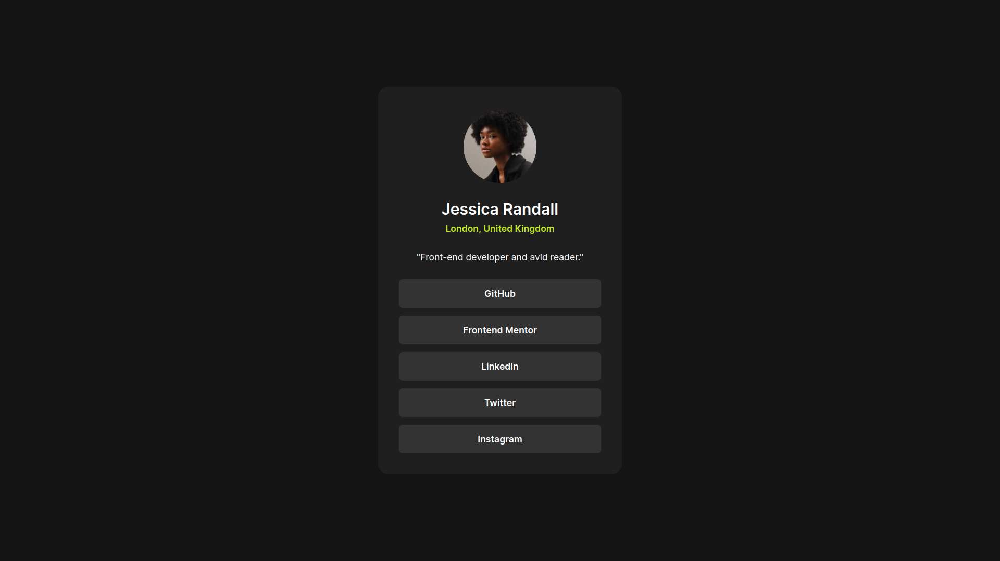

# Frontend Mentor - Social links profile solution

This is a solution to the [Social links profile challenge on Frontend Mentor](https://www.frontendmentor.io/challenges/social-links-profile-UG32l9m6dQ).

## Table of contents

- [Overview](#overview)
  - [The challenge](#the-challenge)
  - [Screenshot](#screenshot)
  - [Links](#links)
- [My process](#my-process)
  - [Built with](#built-with)
  - [What I learned](#what-i-learned)
  - [Continued development](#continued-development)

## Overview

### The challenge

Users should be able to:

- See hover and focus states for all interactive elements on the page

### Screenshot

### Links

- Solution URL: [on frontend mentor](https://www.frontendmentor.io/solutions/social-links-preview-bePKmIPTTN)
- Live Site URL: [on netlify](https://6609bdb1e4397fb85868146a--relaxed-donut-349f36.netlify.app)

## My process

### Built with

- React
- Tailwindcss

### What I learned

- got more comfotable with customizing tailwind theme
- learned that npm run preview actually run the dist folder
- deploying on netlify using drag and drop is just better, simple and effective

### Continued development

- want to understand how vercel deploy
- get used to react chrome dev tools
- understand how static files like images work with vite

